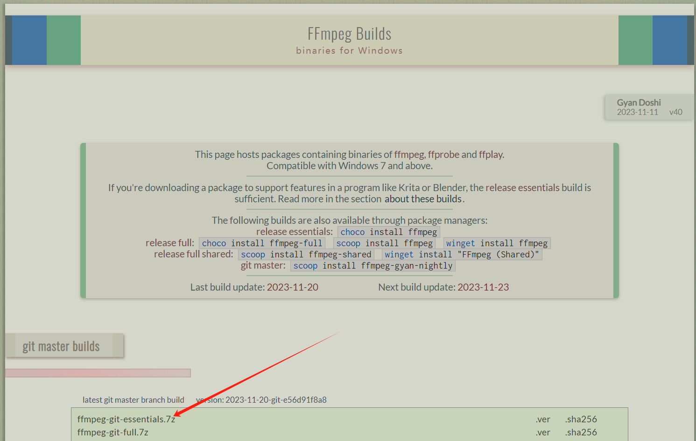
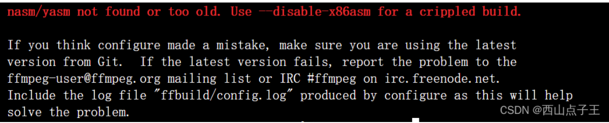
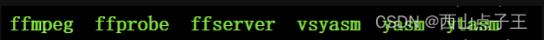

# windows 要下载 ffmpeg.exe程序
https://ffmpeg.org/download.html#build-linux

https://www.gyan.dev/ffmpeg/builds/

给ffmpeg.exe设置好Path


# Linux环境安装配置ffmpeg

## 参考文章：

https://zhuanlan.zhihu.com/p/347780238    
https://blog.csdn.net/jlq_diligence/article/details/104686407           
## 下面是步骤：

* 1.获取ffmpeg源码包
通过ffmpeg官方网站获取，在Linux执行下载、解压命令，这里选择了ffmpeg 3.4.4 “Cantor” 版本.
``` terminal
wget http://www.ffmpeg.org/releases/ffmpeg-3.4.4.tar.gz
tar -zxvf ffmpeg-3.4.4.tar.gz
```

* 2.配置与编译ffmpeg
首先执行命令进入到ffmpeg目录
``` terminal
cd ./ffmpeg-3.4.4
```
* 执行命令开始配置 ffmpeg
``` terminal
./configure --enable-ffplay --enable-ffserver
```
* 此时可能会有如下报错

这时需要安装yasm。执行以下命令，这里进行yasm 1.3.0的安装
``` terminal
wget http://www.tortall.net/projects/yasm/releases/yasm-1.3.0.tar.gz  #下载源码包
tar zxvf yasm-1.3.0.tar.gz #解压
cd yasm-1.3.0 #进入目录
./configure #配置
make && make install #编译安装
```

完成后，将目录重新切换至ffmpeg-3.4.4下，继续执行
``` terminal
./configure --enable-ffplay --enable-ffserver
```
接着编译并安装
``` terminal
make;make install
```
这一步需要执行较长时间，我用了十分钟左右

安装完成，使用以下命令查看
``` terminal
cd /usr/local/bin/
ls
```


